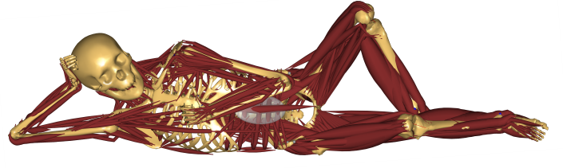

AnyPyTools' documentation!
======================================

AnyPyTools is a toolkit for working with the AnyBody Modeling System (AMS) from
Python. 

Its main purpose is to launch AnyBody simulations and collect results. It has a
scheduler to launch multiple instances of AMS utilising computers with multiple
cores. AnyPyTools makes it easy to do parameter and sensitivity and many other
things which is not possible directly within the AnyBody Modeling System.

=============
Installation
=============

.. toctree::
    :titlesonly:
    :maxdepth: 1

    dependencies
    install_guide

=============
Guides
=============

The tutorials below are also available as a set of 
`Jupyter Notebooks <http://nbviewer.jupyter.org/github/AnyBody-Research-Group/AnyPyTools/blob/master/docs/Tutorial/00_AnyPyTools_tutorial.ipynb>`_

.. toctree::
    :titlesonly:
    :maxdepth: 1

    Tutorial/01_Getting_started_with_anypytools.ipynb
    Tutorial/02_Generating_macros.ipynb
    Tutorial/03_Working_with_output_from_Anybody.ipynb
    Tutorial/04_Batch_processing_multiple_models.ipynb
    Tutorial/05_Monte_Carlo_studies_etc.ipynb
    Tutorial/06_Tips&Tricks.ipynb

==============
Documentation
==============

.. toctree::
    :titlesonly:
    :maxdepth: 1

    api/index
    pytest_plugin

============
Development
============

I greatly appreciate any contributions to AnyPyTools!  If you would like to contribute,
it is as easy as forking the repository on GitHub, making your changes, and
issuing a pull request.  If you have any questions about this process don't
hesitate to ask.

See the `Developer's Guide <devguide.html>`_ for more information about contributing.

.. toctree::
    :titlesonly:
    :maxdepth: 1
    
    devguide
    changelog

=============
Usefull links
=============

If you have questions or comments, please contact the author directly, or
open a `new issue on GitHub <https://github.com/AnyBody-Research-Group/AnyPyTools/issues/new>`_

* `Jupyter Notebook tutorial <http://nbviewer.jupyter.org/github/AnyBody-Research-Group/AnyPyTools/blob/master/docs/Tutorial/00_AnyPyTools_tutorial.ipynb>`_
* `Documentation <anybody-research-group.github.io/anypytools-docs>`_
* `Gitter <https://gitter.im/AnyBody-Research-Group/AnyPyTools>`_
* `GitHub Repository <https://github.com/AnyBody-Research-Group/AnyPyTools>`_
* :ref:`genindex`
* :ref:`modindex`
* :ref:`search`

